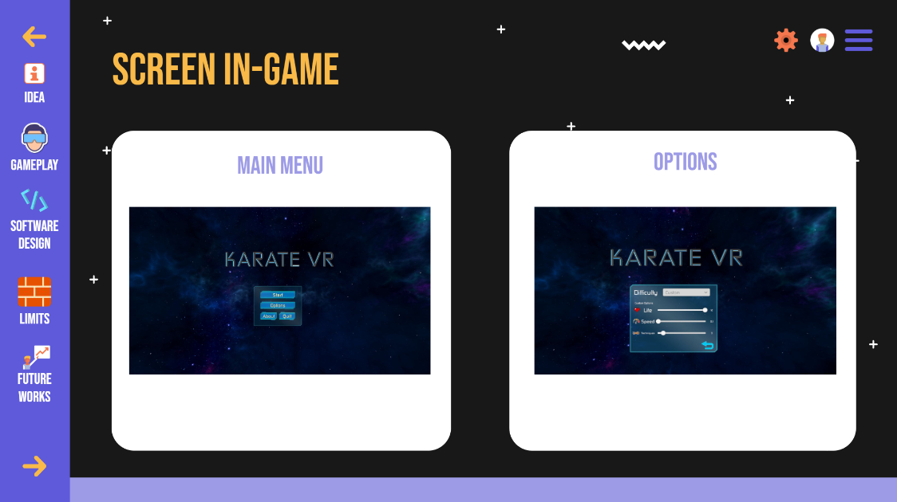
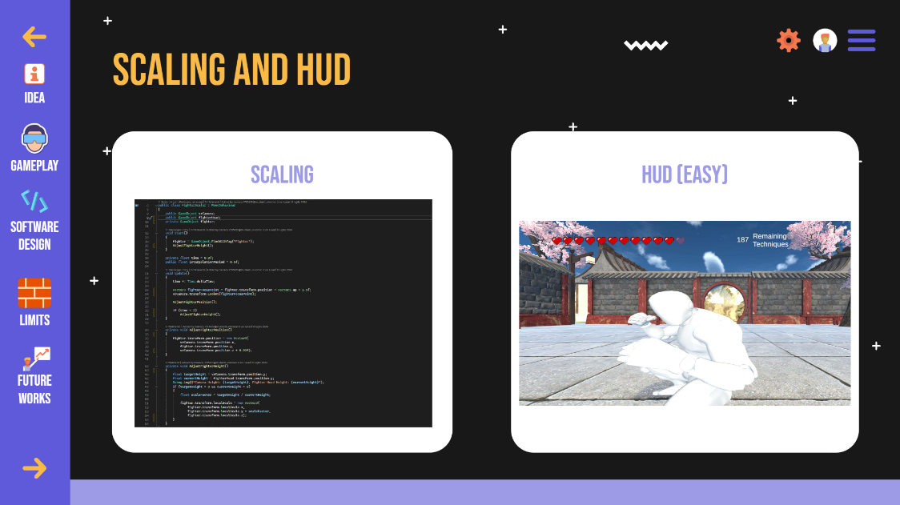
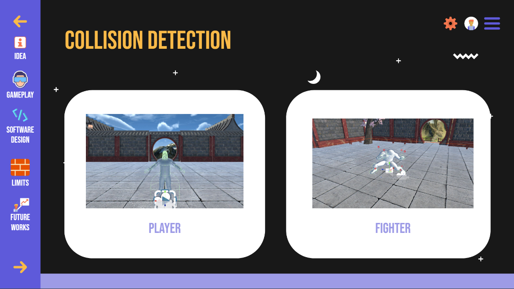

# Karate VR for Meta Quest 3
Our project aims to revolutionize karate training through a virtual reality (VR) platform. The game allows users to practice kumite defensive techniques and blocks with real-time feedbacks of their movements. 

This system exploits Meta Quest 3 built-in cameras to map the user's hands and recongize gestures.

## Prerequisites

Meta Quest 3

Unity for development and playing the game, version 2022.3.15f

## Installing the game:

1. Extract SourceCode_KarateVR-MetaQuest3.zip and open in Unity

2. Plug Meta Quest 3 with debug mode on and enable installation of apps from other sources

3. Install and Launch
   
	3.1 Open the project on Unity and go to "build settings"
   
	3.2 Choose Android as the building platform
   
	3.3 Select Meta Quest 3 from "Run Device"
   
	3.4 Press "build and run"
   

6. Wait for the build to complete and the game to launch.
   
7. Enjoy playing the game and learning karate!
